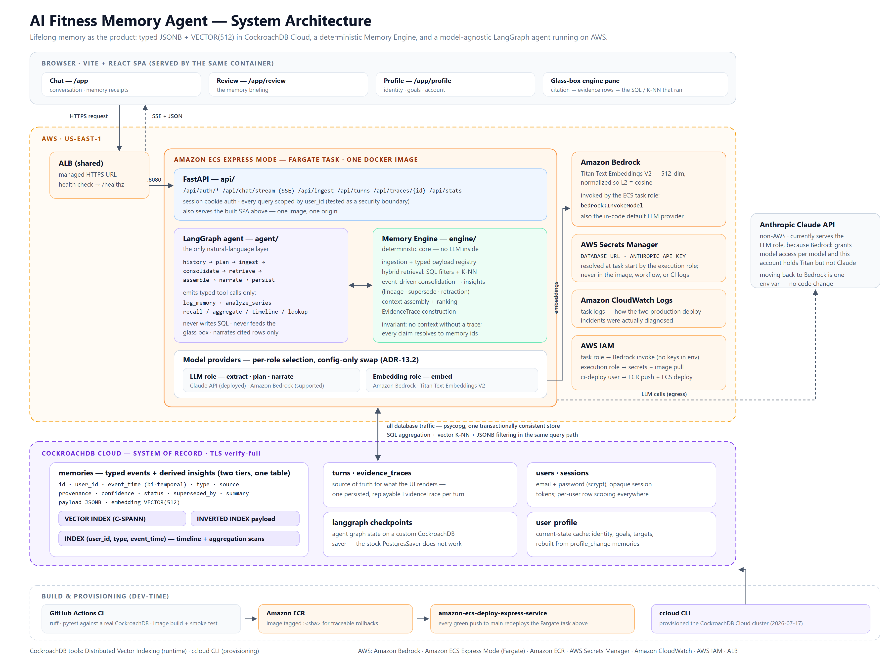

# AI Fitness Memory Agent

> An AI health companion that never forgets — persistent, lifelong memory as the product,
> built on CockroachDB and AWS. Entry for the **CockroachDB × AWS Agentic Memory Hackathon**.

Most AI assistants treat every conversation independently. This one turns every meal, workout,
body scan, blood report, and conversation into **typed, evidence-grade memories** in
CockroachDB — then reasons across months of history. Ask *"what changed before my body fat
started dropping?"* and you get a dated answer that cites memory IDs, with a **glass-box UI**
that resolves every claim to the raw evidence rows and shows the actual SQL and vector queries
that produced them.

**Live:** <https://ai-2e921ede8718444985c5b24e7fb23497.ecs.us-east-1.on.aws> ·
[health](https://ai-2e921ede8718444985c5b24e7fb23497.ecs.us-east-1.on.aws/healthz) ·
[API docs](https://ai-2e921ede8718444985c5b24e7fb23497.ecs.us-east-1.on.aws/docs)

**Status: the product is complete and deployed.** Phases 1–6 shipped — cloud foundations and
day-one canaries, the memory write path, hybrid retrieval and the LangGraph agent, history
replay, the insight engine, and the full glass-box UI (conversation with live streaming
progress, memory receipts, evidence traces, three product surfaces). Phase 7 — evals,
submission evidence, and the demo video — is in progress. Last full run: **772 Python tests
green** against real CockroachDB and **15/15 Playwright E2E** with zero axe violations,
`tsc` and `ruff` clean. Built solo with Claude Code. Execution plan:
[docs/implementation-roadmap.md](docs/implementation-roadmap.md).



*Full architecture write-up: [docs/evidence/architecture.pdf](docs/evidence/architecture.pdf)*

## Quickstart

The whole product — API and UI — is one Docker image. This is the path that gives you the real
thing in two commands.

```bash
# 1. a local single-node CockroachDB
docker run -d --name crdb -p 26257:26257 -p 8081:8080 \
  cockroachdb/cockroach:v26.2.4 start-single-node --insecure

# 2. build and run the app (schema is created automatically at startup)
docker build -t fitness-memory .
docker run --rm -p 8080:8080 \
  -e DATABASE_URL="postgresql://root@host.docker.internal:26257/defaultdb?sslmode=disable" \
  -e LLM_PROVIDER=claude_api -e ANTHROPIC_API_KEY=sk-ant-... \
  -e EMBEDDING_PROVIDER=bedrock -e AWS_REGION=us-east-1 \
  -v "$HOME/.aws:/home/app/.aws:ro" \
  fitness-memory
```

Open <http://localhost:8080>. (On Linux, `host.docker.internal` is not resolvable by default —
use `--network host` and `127.0.0.1` instead.) Model access is the only thing you must supply: see
[Choosing model providers](#choosing-model-providers-per-role) — an all-Bedrock run is
`-e MODEL_PROVIDER=bedrock` plus the mounted AWS credentials, and dropping the AWS mount
entirely still works (memories are stored with `NULL` embeddings and semantic recall degrades
honestly rather than silently).

### Try it in 60 seconds

1. **Sign up** at `/signup` — a brand-new account starts with genuinely empty memory.
2. **Log something**: *"250g curd, 3 eggs, and a 40-minute upper body session"*. Watch the
   engine pane narrate the real graph as it runs — `extracting → analyzing → retrieving →
   assembling context → generating` — then check the memory receipt for the typed rows it wrote.
3. **Ask a memory question**: *"how much protein did I average this week?"* or *"what have I
   logged about my knee?"*
4. **Click a citation.** The evidence drawer opens the exact memory rows behind that claim,
   with provenance and confidence, and *"how this was retrieved"* shows the SQL and K-NN
   queries that actually executed.
5. **Visit `/app/review`** for the memory briefing and `/app/profile` for goals and identity.

### Local development

```bash
pip install -e . --group dev        # editable install + pytest/ruff (needs pip >= 25.1)
cp .env.example .env                # then edit — see Configuration below
cd web && npm ci && npm run build   # build the SPA; without this you get an API with no UI
cd .. && uvicorn api.main:app --port 8080
```

Python ≥ 3.10, Node ≥ 22. For frontend work run `npm run dev` in `web/` alongside the uvicorn
process — Vite proxies `/api` and `/healthz` to port 8080, so `same-origin` behaviour is
identical in dev and production.

## Architecture

A custom **Memory Engine** (deterministic; the centerpiece) owns ingestion, hybrid SQL + vector
retrieval, event-driven consolidation into derived insights with lineage and retraction, and
the construction of `EvidenceTrace` artifacts that drive the UI. A model-agnostic **LangGraph
agent** is the only natural-language layer — it emits typed tool calls; the LLM narrates but
never generates SQL and never feeds the glass box. Storage is **CockroachDB** (typed JSONB
payloads + `VECTOR(512)` embeddings in one transactionally consistent store, so aggregation and
semantic recall never disagree). Hosting is a single Docker image on **Amazon ECS Express Mode**
(Fargate + ALB), delivered by CI on every push to `main`.

**The two memories, deliberately never blurred.** *Short-term* is the recent messages of the
current thread, read from `turns`; it reaches planning and narration only, and is never
citable, never inside an evidence trace, and never an ingestion source. *Long-term* is the typed
rows in `memories`, retrieved deterministically and cited by ID. That separation is structural,
not a convention — see [CLAUDE.md](CLAUDE.md) and
[ADR-14.15/14.16](docs/office-hours/09-decisions.md#adr-14).

Photo ingestion (a chat-attached meal photo) uses vision directly — **no S3**: the image is
decoded, validated, EXIF-stripped, sent to the model, and discarded, never persisted. Full
design: [docs/office-hours/](docs/office-hours/README.md).

## Repository structure

```
engine/     Memory Engine package — ingestion, retrieval, consolidation, traces
agent/      LangGraph agent: planner, typed tools, narration, checkpointer
api/        FastAPI app: auth, chat + SSE streaming, ingest, traces, SPA serving
web/        Vite + React glass-box UI (Chat, Review, Profile)
cli/        migrate, embedding backfill, consolidation, replay
evals/      Live-model eval suites
docs/       Canonical design docs (source of truth)
  office-hours/             Architecture, ADRs, task backlog, test plan
  engineering/              Deep dives: vector index, replay, consolidation, lessons learned
  evidence/                 Hackathon evidence + architecture diagram/PDF
  implementation-roadmap.md Day-to-day execution phases
```

Each package carries a docstring pointing at its design doc.
[docs/office-hours/09-decisions.md](docs/office-hours/09-decisions.md) records every
architectural decision and its rejected alternatives.

## Configuration

All configuration is environment variables, read in [`engine/config.py`](engine/config.py).
Copy [`.env.example`](.env.example) to `.env` — it documents every variable, which are required,
and what each defaults to. In development the `.env` file is loaded automatically; real
environment variables always win. The deployed image has no `.env` at all — ECS supplies real
variables ([docs/deploy.md](docs/deploy.md)).

| Variable | Required? | Default |
|---|---|---|
| `DATABASE_URL` | in practice yes | a local single-node CockroachDB URL |
| everything else | no | see [`.env.example`](.env.example) |

Model access is not configured by environment variables: Amazon Bedrock credentials come from
the AWS credential chain (locally `aws configure`/SSO, in ECS the task role). Only model *ids*
and the region are overridable.

### Choosing model providers (per role)

Two model roles are selected **independently**
([ADR-13.2](docs/office-hours/09-decisions.md#adr-13), amended 2026-08-02):

| Variable | Serves | Notes |
|---|---|---|
| `LLM_PROVIDER` | `extract_events`, `plan`, `narrate` | freely swappable |
| `EMBEDDING_PROVIDER` | `embed` | pinned by `VECTOR(512)`; see the warning below |
| `MODEL_PROVIDER` | both, when the two above are unset | backward-compatible shorthand |

They are separate because Bedrock grants model access *per model*: an account can hold Titan
embeddings without Claude inference — exactly the case this project hit, and exactly what the
deployed configuration runs. A mixed deployment is a first-class, supported configuration:

```ini
# .env — Claude API reasoning + Bedrock embeddings
DATABASE_URL=postgresql://...            # your CockroachDB
LLM_PROVIDER=claude_api
EMBEDDING_PROVIDER=bedrock
ANTHROPIC_API_KEY=sk-ant-...             # read by the SDK, not by engine/config.py
```

An all-Bedrock deployment is `MODEL_PROVIDER=bedrock` (the default); an all-Claude-API one is
`MODEL_PROVIDER=claude_api`. Every one of these is a configuration change with **no code
change**, which is the acceptance check for the model-independence contract
([ADR-1](docs/office-hours/09-decisions.md#adr-1)).

> ⚠️ **`EMBEDDING_PROVIDER` is effectively a one-way door.** Vectors from different embedding
> models are not comparable, so changing it after memories exist means nulling and re-embedding
> every row. `LLM_PROVIDER` carries no such constraint.

**One capability is deliberately missing from the Claude API.** It has no embeddings endpoint,
and Titan V2 is a Bedrock model — which is precisely why the roles are separable. Rather than
fabricating vectors, `ClaudeAPIProvider.embed()` raises, and the write path stores memories with
**NULL embeddings** that stay eligible for `python -m cli.backfill` once a real embedder is
configured. So under an all-Claude-API run: every ingest logs `embedding failed; N rows -> NULL,
backfill pending` (expected, not a bug), semantic recall reports its own failure in the
response's `errors` instead of pretending it searched, and every other tool — aggregation,
timeline, lookup, counts — works normally.

## Tests

```bash
pytest                       # canaries skip visibly without a DB; REQUIRE_DB=1 to enforce
cd web && npm run test:e2e   # Playwright E2E (15 specs)
```

Tests run against a **real** single-node CockroachDB, never a mock or an in-memory substitute —
start one with the Docker command in the Quickstart. CI does the same on every push and also
builds and smoke-tests the Docker image. Two day-one canaries are permanent tests: the
`VECTOR(512)` index with K-NN ordering, and LangGraph checkpointing on CockroachDB.

> **Two-cluster rule:** the suite reads `DATABASE_URL_TEST_ONLY`. `DATABASE_URL` holds real
> data and must never be pointed at by the tests.

## Deployment

Every push to `main` that passes tests is built, pushed to Amazon ECR tagged by commit SHA, and
deployed to Amazon ECS Express Mode by the official AWS action — no manual deploy step exists.
Full runbook, including the two production incidents and what they taught:
[docs/deploy.md](docs/deploy.md).

## Hackathon compliance

**CockroachDB tools (≥2 required):**

| Tool | How it is used |
|---|---|
| **Distributed Vector Indexing** | `VECTOR INDEX memories_embedding_idx` on the `memories` table drives semantic recall; a permanent CI canary asserts K-NN ordering on normalized vectors *and* index usage in the plan ([engine/schema.sql](engine/schema.sql), [test_vector_canary.py](engine/tests/test_vector_canary.py)) |
| **ccloud CLI** | Provisioned the CockroachDB Cloud cluster (2026-07-17) |

**AWS services (≥1 required):** **Amazon Bedrock** (Titan Text Embeddings V2 — 512-dim,
normalized — invoked via the ECS task role; also the in-code default LLM provider),
**Amazon ECS Express Mode** (Fargate + shared ALB), **Amazon ECR**, **AWS Secrets Manager**,
**Amazon CloudWatch Logs**, and **AWS IAM** (separate task, execution, and CI identities).
Amazon S3 was in the original design for photo storage and is **not** used by what shipped —
photos are processed in memory and discarded.

> **The honest vector-index answer.** The index is real, created, and CI-verified. At the
> product's current query shape, the *filtered* per-user K-NN executes as a scan, because this
> CockroachDB version abandons the vector index under residual filters — measured with `EXPLAIN`,
> not assumed. The filters are correctness boundaries (user scoping, superseded-row exclusion),
> so they stay; the index becomes load-bearing exactly when per-user row counts outgrow a scan.
> Full measurements: [docs/engineering/vector-index-and-filtered-knn.md](docs/engineering/vector-index-and-filtered-knn.md).

Everything we learned running this workload on CockroachDB — including a 21-minute DELETE, a
checkpointer incompatibility, and `TRUNCATE` silently blocked by a v25 default — is written up
in [docs/engineering/cockroachdb-lessons-learned.md](docs/engineering/cockroachdb-lessons-learned.md).

**Pre-existing work:** none. Every commit falls inside the submission period; there is no
starter template or forked codebase. Standard frameworks are used as dependencies, some UI
primitives were scaffolded with the shadcn CLI, and the project was built solo with **Claude
Code** under my direction and review.

## License

[MIT](LICENSE) © 2026 Aditya Babanrao Jamge
