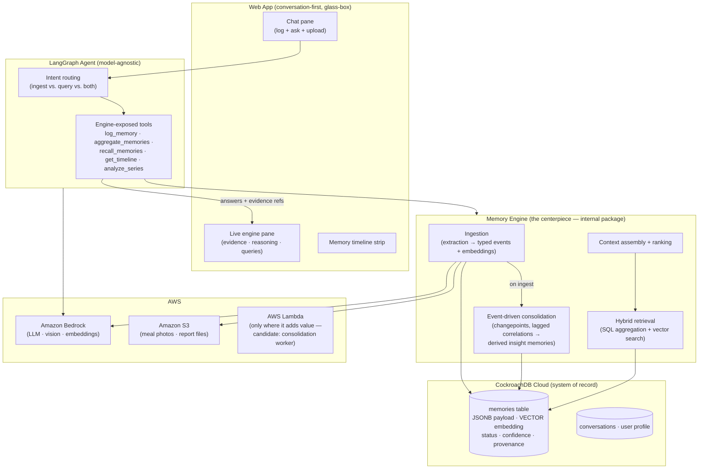

# 02 — Architecture Overview

> Part of the [office-hours canonical docs](README.md). Related: [03-memory-engine.md](03-memory-engine.md), [04-database-design.md](04-database-design.md), [05-agent-architecture.md](05-agent-architecture.md).

## System diagram

## Components

| Component | Responsibility | Key doc |
|---|---|---|
| **Memory Engine** | Ingestion, hybrid retrieval, timeline reconstruction, aggregation, event-driven consolidation, context assembly, ranking, context optimization. A clean internal package with no LLM-provider dependence. | [03](03-memory-engine.md) |
| **CockroachDB Cloud** | System of record: memories (typed JSONB events + embeddings + derived insights), conversations, user profile. One transactionally consistent store for both SQL aggregation and vector search. | [04](04-database-design.md) |
| **LangGraph agent** | Model-agnostic orchestration; calls tools the engine exposes; never touches the DB directly. | [05](05-agent-architecture.md) |
| **Web app** | Conversation-first UI with always-visible engine pane, timeline, memory receipts. | [07](07-glass-box-ui.md) |
| **Seed replay CLI** | Replays the (sanitized) reconstructed history through the **production ingestion pipeline** — no raw SQL seeding, ever. | [03](03-memory-engine.md#replay) |

## AWS service usage (hackathon requirement: ≥1)

| Service | Role | Load-bearing? |
|---|---|---|
| **Amazon Bedrock** | Default LLM for the agent; vision extraction for meal photos; embeddings | Yes — primary |
| **Amazon S3** | Meal photos and blood-report file storage (referenced from memory payloads) | Yes |
| **AWS Lambda** | Candidate host for the consolidation worker and/or ingestion webhook — adopted **only where it adds value** (builder rule: no infra for completeness) | Conditional |

Hosting target for the web app is open ([OQ2](10-open-questions.md)) but deploys in
Milestone 1 regardless (deploy-early rule, [08-roadmap.md](08-roadmap.md)).

## CockroachDB tool usage (hackathon requirement: ≥2, we evidence 3)

| Tool | Usage | Evidence to capture |
|---|---|---|
| **Distributed Vector Indexing** | Runtime semantic memory: embeddings column + vector index on `memories` | The code itself; day-one verification task in Milestone 1 |
| **Managed MCP Server** | AI-assisted development and debugging (dev-time, **not** the runtime memory interface) | Logged MCP sessions + README section describing what the agent did with it |
| **ccloud CLI** | Cluster provisioning and ops scripts | Screen recording of provisioning; scripts committed to repo |

## Data flow — the two core paths

**Ingestion turn** (user sends "250g curd, 3 eggs" + photo):
photo → S3; text+photo → Bedrock extraction → typed event rows (+ embeddings) →
CockroachDB → consolidation check on affected series → inline **memory receipt** in chat +
engine pane update.

**Query turn** (user asks the money question):
question → agent plans retrieval → engine runs SQL aggregation + vector search (+ existing
derived insights) → context assembly ranks evidence → LLM narrates answer **with memory-ID
citations** → engine pane shows evidence rows, reasoning lineage, and the executed queries.
