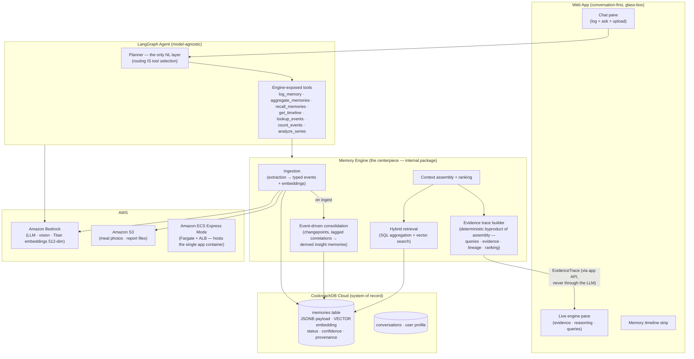

# 02 — Architecture Overview

> Part of the [office-hours canonical docs](README.md). Related: [03-memory-engine.md](03-memory-engine.md), [04-database-design.md](04-database-design.md), [05-agent-architecture.md](05-agent-architecture.md).

## System diagram

## Components

| Component | Responsibility | Key doc |
|---|---|---|
| **Memory Engine** | Ingestion, hybrid retrieval, timeline reconstruction, aggregation, event-driven consolidation, context assembly, ranking, context optimization, **deterministic evidence-trace construction** ([ADR-12](09-decisions.md#adr-12)). A clean internal package with no LLM-provider dependence. | [03](03-memory-engine.md) |
| **CockroachDB Cloud** | System of record: memories (typed JSONB events + embeddings + derived insights), conversations, user profile. One transactionally consistent store for both SQL aggregation and vector search. | [04](04-database-design.md) |
| **LangGraph agent** | Model-agnostic orchestration; calls tools the engine exposes; never touches the DB directly. | [05](05-agent-architecture.md) |
| **Web app** | Conversation-first UI with always-visible engine pane, timeline, memory receipts. | [07](07-glass-box-ui.md) |
| **Seed replay CLI** | Replays the (sanitized) reconstructed history through the **production ingestion pipeline** — no raw SQL seeding, ever. | [03](03-memory-engine.md#replay) |

## AWS service usage (hackathon requirement: ≥1)

| Service | Role | Load-bearing? |
|---|---|---|
| **Amazon Bedrock** | Default LLM for the agent; vision extraction for meal photos; Titan V2 embeddings (512-dim, normalized) | Yes — primary |
| **Amazon S3** | Meal photos and blood-report file storage (referenced from memory payloads) | Yes |
| **Amazon ECS Express Mode** | Hosts the single Docker image (FastAPI + built Vite/React SPA) on Fargate + shared ALB; deploys in Milestone 1 (deploy-early). *Originally App Runner — closed to new customers 2026-04-30; ADR-13.3 amendment* | Yes |

**Lambda is not in the runtime architecture** — consolidation runs synchronously in the
ingestion request with a time budget ([ADR-13.1](09-decisions.md#adr-13)); no scheduler, no
queue (builder rule: no infra for completeness).

**Application model:** standard multi-user SaaS — email+password accounts, per-user row
scoping, every new account starts with empty memory ([ADR-13.4](09-decisions.md#adr-13)).
Conversation state: LangGraph PostgresSaver checkpointer on CockroachDB for graph execution
state; the app's `turns` + `evidence_traces` tables are the source of truth for UI rendering
([ADR-13.14](09-decisions.md#adr-13)). Thread ids are namespaced by user, and the checkpoint
holds only small serde-safe channels — heavyweight turn artifacts never enter it, enforced at
the checkpointer's serialization path ([ADR-14.9/14.13](09-decisions.md#adr-14),
[engineering deep dive](../engineering/graph-state-durability.md)).

## CockroachDB tool usage (hackathon requirement: ≥2, we evidence 3)

| Tool | Usage | Evidence to capture |
|---|---|---|
| **Distributed Vector Indexing** | Runtime semantic memory: embeddings column + vector index on `memories` | The code itself; day-one verification task in Milestone 1 |
| **Managed MCP Server** | AI-assisted development and debugging (dev-time, **not** the runtime memory interface) | Logged MCP sessions + README section describing what the agent did with it |
| **ccloud CLI** | Cluster provisioning and ops scripts | Screen recording of provisioning; scripts committed to repo |

## Data flow — the two core paths

**Ingestion turn** (user sends "250g curd, 3 eggs" + photo):
photo → S3; text+photo → Bedrock extraction → typed event rows (+ embeddings) →
CockroachDB → consolidation check on affected series → inline **memory receipt** in chat +
engine pane update.

**Query turn** (user asks the money question):
question → agent plans retrieval (**one planning call — selecting tools *is* the routing**)
→ engine runs SQL aggregation + vector search (+ existing derived insights) → context
assembly ranks evidence **and emits an `EvidenceTrace` as a deterministic byproduct**
(executed queries, evidence set, insight lineage, ranking) → LLM narrates answer **with
memory-ID citations validated against the trace** → engine pane renders the trace directly
via the app API — **UI data never passes through the model**
([ADR-12](09-decisions.md#adr-12)).

**Both at once** ("logged my run — am I improving?"): the planner selects `log_memory` *and*
retrieval tools in the same call, and the graph runs ingestion **first**, so the event just
reported is already committed when the same turn's aggregation scans for it
([ADR-14.3](09-decisions.md#adr-14)).
