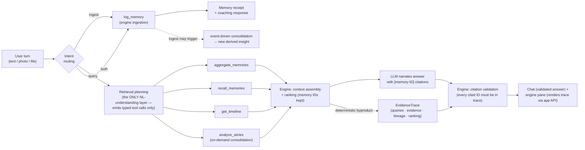

# 05 — Agent Architecture (LangGraph)

> Part of the [office-hours canonical docs](README.md). Related: [03-memory-engine.md](03-memory-engine.md), [02-architecture-overview.md](02-architecture-overview.md).

## Role division (the load-bearing boundary)

- **The Memory Engine is the intelligence.** It decides what evidence exists, how it's
  retrieved, ranked, and assembled.
- **The LLM is a replaceable narrator + extractor.** It turns user turns into extraction
  requests and assembled evidence into cited natural-language answers.
- **LangGraph is the wiring.** Model-agnostic orchestration so Bedrock/Claude/OpenAI/Gemini/
  Llama swap without touching the memory architecture (a hard constraint from the project
  brief).

## Graph shape (design-level)

Notes:
- A turn can be **both** ingest and query ("logged my run — am I improving?").
- Ingestion may synchronously surface a fresh derived insight ("that's a bench PR — your 3rd
  following 7.5h+ sleep"), which is the proactive-feeling moment without any scheduler.
- The agent **never issues raw SQL**; tools are the engine's contract
  ([03-memory-engine.md](03-memory-engine.md)).

## The query-planning boundary

The planner node is the **only** place in the system that understands natural language. Its
entire output is structured tool calls with typed, validated parameter slots; "mixed
retrieval" is the planner issuing several tool calls, merged by the engine's assembly into
one ranked evidence set with one trace. Below the tool-call boundary everything is
deterministic — builder-composed parameterized SQL and vector search, heuristic ranking,
trace emission. Full contract: [06-retrieval-strategy.md → query-planning boundary](06-retrieval-strategy.md#query-planning).

## Model independence contract

- All model calls (chat narration, extraction, vision, embeddings) go through one provider
  interface owned by the app, defaulting to **Amazon Bedrock**.
- The Memory Engine takes that interface as a dependency — it never imports a provider SDK.
- Embeddings: Titan Text Embeddings V2, 512-dim, normalized ([ADR-13.2](09-decisions.md#adr-13)).
- Acceptance check: switching provider must be a config change, zero memory-layer edits.

## Conversation state ([ADR-13.14](09-decisions.md#adr-13))

LangGraph's built-in **PostgresSaver checkpointer runs on CockroachDB** (Postgres wire
compat) and holds graph execution state — thread checkpoints, resumability. It is verified
by a **day-one canary** (same gate class as the vector index; fallback is a thin hand-rolled
checkpointer). The app's own `turns` + `evidence_traces` tables, written in one transaction
when a turn completes, are the source of truth for everything the UI renders. Known
footguns handled at setup: `.setup()` once, `autocommit=True` + `dict_row`, thread_id < 255
chars, strict msgpack deserialization, no blobs in graph state (S3 URLs only).

## Answer contract (what "narrate" must produce)

Every factual claim in an answer carries a memory-ID citation that the UI can resolve to
evidence rows ([07-glass-box-ui.md](07-glass-box-ui.md)). The narrator may only cite IDs
present in the turn's `EvidenceTrace` — and this is **enforced, not requested**: the engine
mechanically validates every citation against the trace after generation
([ADR-12](09-decisions.md#adr-12)). Invalid citations are flagged in the UI.

**Honest scope of that guarantee ([ADR-13.13](09-decisions.md#adr-13)):** mechanical
validation proves citations resolve to real evidence; it does not prove the prose states
the cited numbers/dates/directions correctly — that fidelity is covered by the
citation-compliance **eval**, and the UI lets any reader compare claim against evidence
with one click. The glass box makes hallucination visible, which is a feature: it keeps the
demo honest and the judges convinced.

**The LLM produces natural language only.** All structured UI data — evidence rows,
lineage, queries, timeline — comes from the deterministic `EvidenceTrace`, fetched by the
UI through the app API. Model output is never the source of glass-box data.
