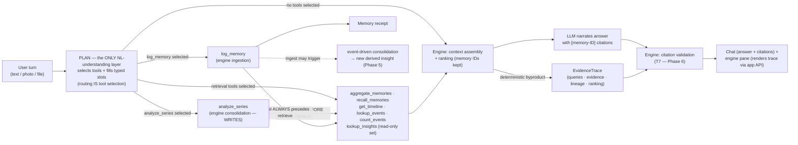

# 05 — Agent Architecture (LangGraph)

> Part of the [office-hours canonical docs](README.md). Related: [03-memory-engine.md](03-memory-engine.md), [02-architecture-overview.md](02-architecture-overview.md).

## Role division (the load-bearing boundary)

- **The Memory Engine is the intelligence.** It decides what evidence exists, how it's
  retrieved, ranked, and assembled.
- **The LLM is a replaceable narrator + extractor.** It turns user turns into extraction
  requests and assembled evidence into cited natural-language answers.
- **LangGraph is the wiring.** Model-agnostic orchestration so Bedrock/Claude/OpenAI/Gemini/
  Llama swap without touching the memory architecture (a hard constraint from the project
  brief).

## Graph shape (as implemented, Phase 3)

Notes:
- **Routing is tool selection, not a separate classification step** ([ADR-14.1](09-decisions.md#adr-14)).
  There is one LLM planning call per turn: `log_memory` among its calls makes the turn an
  ingest, retrieval calls make it a query, both make it both, and **no** calls make it
  conversational. The graph is a *pure interpreter* of that output — it contains no natural
  language understanding of its own.
- **An empty plan is an assertion, not an error** ([ADR-14.2](09-decisions.md#adr-14)): a
  greeting is answered conversationally without inventing a retrieval or failing the turn.
- **Ingest always precedes retrieve** on a "both" turn ([ADR-14.3](09-decisions.md#adr-14)),
  so a memory logged this turn is already committed when the same turn's aggregation scans
  for it ("logged my run — am I improving?").
- **The turn has two write stages, and both precede retrieval** (Phase 5 §4.9): `log_memory`
  → `analyze_series` → retrieval. The second ordering is the first one applied to tier 2 — an
  insight derived this turn must be visible to the same turn's `lookup_insights`, or the
  engine would derive a claim and then answer as though it had not.
- **The two write tools are dispatched by the graph, never by the tool layer.** `log_memory`
  and `analyze_series` go to a service; the closed retrieval builder set stays **read-only**
  (invariant I-17) because the writers are not members of it. `prepare_call` refuses both.
- **Assembly runs on every turn that narrates**, so a trace always exists — honestly empty
  (zero retrieval steps) on an ingest-only or conversational turn. That keeps ADR-12's
  by-construction property uniform rather than special-cased.
- **A failed tool costs that tool, not the turn** ([ADR-14.12](09-decisions.md#adr-14)): an
  invalid slot or a failed query embedding is recorded and reported while the rest of the
  retrieval still runs.
- Ingestion may synchronously surface a fresh derived insight ("that's a bench PR — your 3rd
  following 7.5h+ sleep"), which is the proactive-feeling moment without any scheduler.
- The agent **never issues raw SQL**; tools are the engine's contract
  ([03-memory-engine.md](03-memory-engine.md)).

## The query-planning boundary

The planner node is the **only** place in the system that understands natural language. Its
entire output is structured tool calls with typed, validated parameter slots; "mixed
retrieval" is the planner issuing several tool calls, merged by the engine's assembly into
one ranked evidence set with one trace. Below the tool-call boundary everything is
deterministic — builder-composed parameterized SQL and vector search, heuristic ranking,
trace emission. Full contract: [06-retrieval-strategy.md → query-planning boundary](06-retrieval-strategy.md#query-planning).

## Model independence contract

- All model calls (chat narration, extraction, vision, embeddings) go through one provider
  **interface** owned by the app, defaulting to **Amazon Bedrock**.
- The Memory Engine takes that interface as a dependency — it never imports a provider SDK.
- Embeddings: Titan Text Embeddings V2, 512-dim, normalized ([ADR-13.2](09-decisions.md#adr-13)).
- **One interface, but not necessarily one backing provider** ([ADR-13.2](09-decisions.md#adr-13),
  amended 2026-08-02). The **LLM** role (`extract_events`/`plan`/`narrate`) and the
  **embedding** role (`embed`) are selected independently — `LLM_PROVIDER` /
  `EMBEDDING_PROVIDER`, each falling back to `MODEL_PROVIDER`. A mixed configuration is
  composed by `CompositeProvider`, which satisfies the same Protocol, so the engine cannot
  tell the difference and no signature below the boundary changes. The LLM is freely
  swappable; the embedder is effectively fixed once memories exist, since vectors from
  different models are not comparable.
- Acceptance check: switching provider must be a config change, zero memory-layer edits.

## Conversation state ([ADR-13.14](09-decisions.md#adr-13), refined by [ADR-14.9](09-decisions.md#adr-14))

LangGraph's built-in **PostgresSaver checkpointer runs on CockroachDB** (Postgres wire
compat) and holds graph execution state — thread checkpoints, resumability. It is verified
by a **day-one canary** (same gate class as the vector index; the canary failed and the
recorded fallback landed as a thin read-path subclass, `CockroachDBSaver` — see
[../engineering/cockroachdb-postgressaver.md](../engineering/cockroachdb-postgressaver.md)).
The app's own `turns` + `evidence_traces` tables, written in one transaction when a turn
completes, are the source of truth for everything the UI renders. Known footguns handled at
setup: `.setup()` once, `autocommit=True` + `dict_row`, thread_id < 255 chars, strict msgpack
deserialization, no blobs in graph state.

**The durability boundary is enforced, not conventional.** Heavyweight turn-local objects —
`ContextBlock`, `EvidenceTrace`, `RetrievalOutcome`, `Receipt` — must never enter checkpointed
state; the checkpoint holds only small serde-safe channels (`messages`, `user_id`, `question`,
`now`, `tz`, `tool_calls`, `answer`, `citations`), and the heavy objects travel on a
per-invocation carrier passed through `RunnableConfig`. A guard on the checkpointer's
serialization path raises if a banned object ever reaches a persist — the single chokepoint
every write flows through, so the invariant cannot be sidestepped by editing the state schema.
Rationale, the LangGraph behavior that forced this design, and the layered enforcement:
[../engineering/graph-state-durability.md](../engineering/graph-state-durability.md).

**Thread identity is namespaced by user** ([ADR-14.13](09-decisions.md#adr-14)): the client's
opaque `thread_id` is prefixed with the caller's `user_id` before it reaches the checkpointer.
Presenting another user's thread id starts your own thread rather than reading theirs —
existence is not probeable, matching the scoping posture of ADR-13.4.

## Answer contract (what "narrate" must produce)

Every factual claim in an answer carries a memory-ID citation that the UI can resolve to
evidence rows ([07-glass-box-ui.md](07-glass-box-ui.md)). The narrator may only cite IDs
present in the turn's `EvidenceTrace` — and this is **enforced, not requested**: the engine
mechanically validates every citation against the trace after generation
([ADR-12](09-decisions.md#adr-12)). Invalid citations are flagged in the UI.

**Honest scope of that guarantee ([ADR-13.13](09-decisions.md#adr-13)):** mechanical
validation proves citations resolve to real evidence; it does not prove the prose states
the cited numbers/dates/directions correctly — that fidelity is covered by the
citation-compliance **eval**, and the UI lets any reader compare claim against evidence
with one click. The glass box makes hallucination visible, which is a feature: it keeps the
demo honest and the judges convinced.

**The LLM produces natural language only.** All structured UI data — evidence rows,
lineage, queries, timeline — comes from the deterministic `EvidenceTrace`, fetched by the
UI through the app API. Model output is never the source of glass-box data.

**What "may only cite IDs in the trace" means concretely** ([ADR-14.8](09-decisions.md#adr-14)):
the citable set is the turn's budgeted memories, **plus** every aggregate/count contributing
ID, **plus** each participating insight's own ID — `ContextBlock.citable_ids()`. Because
assembly is a pure function ([ADR-14.7](09-decisions.md#adr-14)), an aggregate's contributing
rows are IDs without snapshot metadata and are not in `trace.evidence`; a validator reading
`trace.evidence` alone would reject a *valid* citation of an aggregated meal.

> **✅ Reconciled 2026-08-06 (Phase 6 M1).** The trace now carries the set itself, as
> `EvidenceTrace.citable_ids` — so "may only cite IDs in the trace" is literally true and the
> validator has exactly one source. Guarded by
> `engine/tests/test_trace_citable_ids.py::test_aggregated_citation_is_not_a_false_positive`.
>
> **An insight's own `evidence_ids` are deliberately not citable** (open question Q1, resolved
> narrow). The narrator may cite an insight's *identity*; the lineage beneath it is **rendered,
> not cited** — it saw the hypothesis, never those rows' contents, so asserting a link between
> them would be a claim the engine cannot mechanically verify. See
> [glass-box-architecture.md §4.1](../engineering/glass-box-architecture.md).

## Model surfaces (the provider contract)

The engine depends on one `ModelProvider` Protocol and nothing else about the LLM. The
**Role** column is what provider selection keys on (ADR-13.2 amendment):

| Surface | Role | Phase | Contract |
|---|---|---|---|
| `extract_events` | LLM | 2 | text → typed events; `[]` is an affirmed "nothing to log", anything unparseable **raises** so the input survives as a note (ADR-13.5) |
| `embed` | **embedding** | 2 | normalized 512-dim vectors, all-or-nothing (ADR-13.2) |
| `plan` | LLM | 3 | turn → typed tool calls; `[]` is "no memory operation needed" ([ADR-14.2](09-decisions.md#adr-14)) |
| `narrate` | LLM | 3 | assembled context → prose with citation markers; **prose only** |
| vision | LLM | 5 | photo → meal events |

Each surface's empty result is a *positive assertion* rather than a shrug — the same posture
in both directions, which is what keeps "never lose the user's input" and "never invent a
retrieval" honest. Acceptance check for model independence: switching provider is a change in
the app's composition root only, with zero edits below the boundary.

## Chat API contract (Phase 3)

`POST /api/chat` `{message, thread_id?}` → `{thread_id, answer, citations, receipts, trace,
errors}`, behind the session cookie. The endpoint is transport only — authenticate, map the
request onto one graph turn, map the result back to JSON; it interprets nothing.

- `trace` rides **inline** in Phase 3 and becomes a `trace_id` fetch when T7 persists it
  ([ADR-14.14](09-decisions.md#adr-14)); the shape is designed so Phase 6 adds fields rather
  than reshaping.
- `errors` surfaces retrieval the engine refused or could not run — the answer may be partial
  and the caller is told so ([ADR-14.12](09-decisions.md#adr-14)).
- Model failure → **502** (the turn is retriable; nothing is half-written, because ingestion
  commits atomically and the checkpoint is written only at turn end). Database unreachable at
  startup → the graph is absent and chat answers **503**, so the deploy-early health check
  stays green instead of crash-looping (ADR-11).
