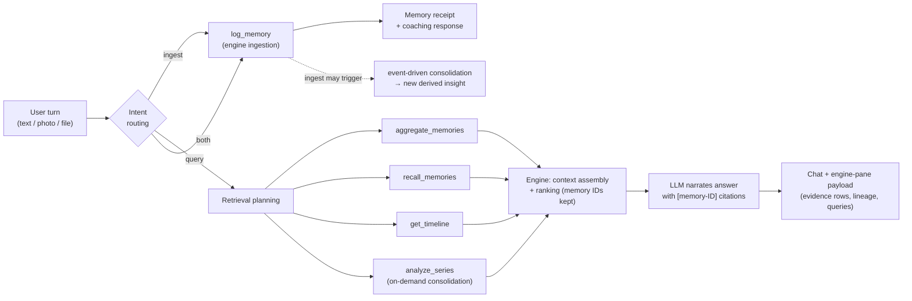

# 05 — Agent Architecture (LangGraph)

> Part of the [office-hours canonical docs](README.md). Related: [03-memory-engine.md](03-memory-engine.md), [02-architecture-overview.md](02-architecture-overview.md).

## Role division (the load-bearing boundary)

- **The Memory Engine is the intelligence.** It decides what evidence exists, how it's
  retrieved, ranked, and assembled.
- **The LLM is a replaceable narrator + extractor.** It turns user turns into extraction
  requests and assembled evidence into cited natural-language answers.
- **LangGraph is the wiring.** Model-agnostic orchestration so Bedrock/Claude/OpenAI/Gemini/
  Llama swap without touching the memory architecture (a hard constraint from the project
  brief).

## Graph shape (design-level)

Notes:
- A turn can be **both** ingest and query ("logged my run — am I improving?").
- Ingestion may synchronously surface a fresh derived insight ("that's a bench PR — your 3rd
  following 7.5h+ sleep"), which is the proactive-feeling moment without any scheduler.
- The agent **never issues raw SQL**; tools are the engine's contract
  ([03-memory-engine.md](03-memory-engine.md)).

## Model independence contract

- All model calls (chat narration, extraction, vision, embeddings) go through one provider
  interface owned by the app, defaulting to **Amazon Bedrock**.
- The Memory Engine takes that interface as a dependency — it never imports a provider SDK.
- Embedding model choice + dimensions is [OQ1](10-open-questions.md); the `VECTOR` column
  dims follow it.
- Acceptance check: switching provider must be a config change, zero memory-layer edits.

## Answer contract (what "narrate" must produce)

Every factual claim in an answer carries a memory-ID citation that the UI can resolve to
evidence rows ([07-glass-box-ui.md](07-glass-box-ui.md)). If the engine's assembled context
doesn't support a claim, the narrator must not make it — the glass box makes hallucination
visible, which is a feature: it keeps the demo honest and the judges convinced.
