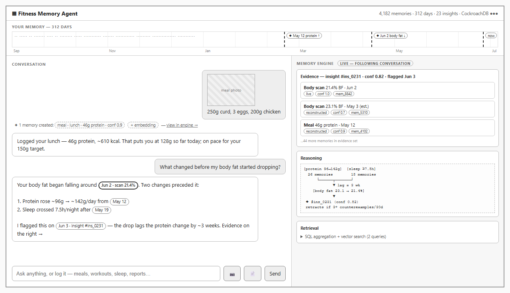

# 07 — Glass-Box UI Philosophy

> Part of the [office-hours canonical docs](README.md). Related: [01-product-vision.md](01-product-vision.md), [05-agent-architecture.md](05-agent-architecture.md).

## Philosophy (builder's words, from the approval of wireframe v3)

> "The application should remain **conversation-first**, where chat is the primary interface
> for every interaction... Every interaction should be automatically transformed into
> structured memories by the Memory Engine. While the conversation remains the primary user
> experience, the Memory Engine should remain **continuously visible** through evidence
> panels, timelines, retrieved memories, confidence scores, and reasoning... The goal is not
> to replace chat with a memory dashboard, but to make the Memory Engine **transparently
> enhance every conversation**."

Two failed drafts define the boundaries: v1 (chat-dominant) made memory look like a sidebar
afterthought; v2 (memory-dashboard-dominant) demoted the conversation. v3 holds both truths.

## Approved wireframe (v3)

Editable source: [assets/wireframe-v3-approved.html](assets/wireframe-v3-approved.html).
This is **visual grammar, not visual design** — fonts/color/polish come in a later design pass
(`/design-consultation`).

## The grammar

| Element | Job | Data source |
|---|---|---|
| **Chat pane (primary, widest)** | Every interaction: questions, meal photos, workout updates, scans, reports. Composer says "Ask anything, or log it." | LLM (natural language only) |
| **Citation chips** | Every factual claim in an answer is a clickable chip (`Jun 2 · scan 21.4%`) resolving to evidence rows — **validated against the trace by the engine** | LLM text + trace validation |
| **Inline memory receipts** | After each ingestion turn: "✦ 1 memory created: meal · lunch · 46g protein · conf 0.9 + embedding" — moment-to-moment proof that talking = logging | `EvidenceTrace` (ingestion form) |
| **Live engine pane** | Always visible, "following the conversation": evidence rows (provenance + confidence badges + memory IDs), reasoning lineage, retrieval queries | `EvidenceTrace` via app API |
| **Memory timeline strip** | Permanent, top: memory density over the full history, changepoint markers (`◆ May 12 protein ↑`), "now" marker | Engine timeline API |
| **Top-bar stats** | `4,182 memories · 312 days · 23 insights · CockroachDB ●●●` — says "memory system," not "chatbot," before a word is read | Engine stats API |

**Data-source rule ([ADR-12](09-decisions.md#adr-12)):** everything structured in this UI is
rendered from the deterministic `EvidenceTrace` and engine APIs. The LLM contributes prose
and citation markers only — **model output is never parsed to build glass-box data**.

## Build order (ranked — cut bottom-up if time compresses)

**Stack:** Vite + React + TypeScript SPA, built to static assets served by FastAPI; SSE for
live engine-pane updates ([ADR-13.7](09-decisions.md#adr-13)).

1. Chat with citation chips
2. Evidence rows with provenance/confidence badges
3. Inline memory receipts
4. **Empty states** — a brand-new account (every user, incl. judges, starts empty per
   ADR-13.4) must make the timeline, stats bar, insights pane, and engine pane read as
   *inviting*, not broken: "your memory starts here" framing, first-log prompt
5. Live engine-pane updates
6. Retrieval-query display ("how this was retrieved")
7. Timeline strip with changepoint markers
8. **Reasoning lineage graph — explicitly first-to-cut** (a visualization project hiding in a
   bullet; fallback: text lineage list)

Plus simple email+password auth ([ADR-13.15](09-decisions.md#adr-13)). Insight copy uses
**"pattern strength" / hypothesis language**, never probability ([ADR-13.12](09-decisions.md#adr-13)).

## Why the glass box is load-bearing (not decoration)

- It makes "Agentic Memory Design" **scoreable** — judges see evidence rows and real queries,
  not claims.
- It renders the hybrid SQL+vector argument on screen (the why-not-Mem0 answer,
  [06-retrieval-strategy.md](06-retrieval-strategy.md)).
- It converts "an LLM said a thing" into "a database proved a thing" — literally: the pane
  renders the engine's deterministic trace, not the model's account of itself.
- It keeps the narrator honest **mechanically**: citations are validated against the
  `EvidenceTrace`; uncited and invalidly-cited claims are visibly flagged
  ([05-agent-architecture.md](05-agent-architecture.md), answer contract; [ADR-12](09-decisions.md#adr-12)).
